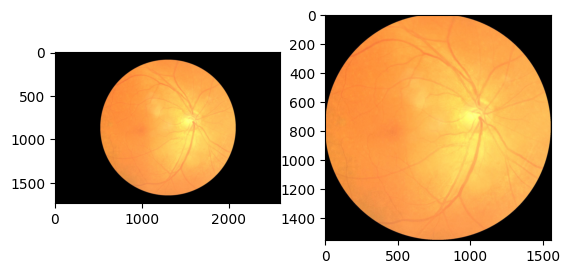

# 1 Setup Data Preprocessing 

Preprocess CSV file to generate label for each of the left and right eye

## Expected output
Processed CSV > `csv/ODIR-5K_Training_Annotations_processed.csv`

train CSV > `csv/processed_train_ODIR-5K.csv`

val CSV > `csv/processed_val_ODIR-5K.csv`

test CSV > `csv/processed_test_ODIR-5k.csv`

# Setup Data Transforms

Hint:
`git checkout v0.2`

# Setup Training Pipeline

Define CSVDataset

Hint: `git checkout v0.3`